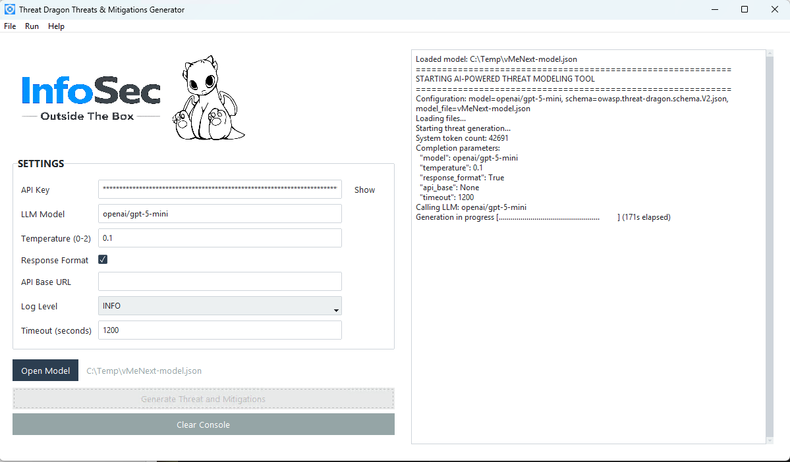
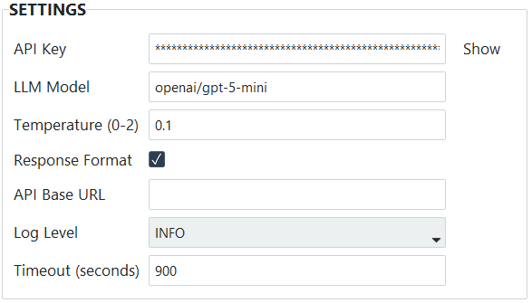

# Threat Dragon AI Tool




A desktop application that automatically generates STRIDE threats and mitigations for [OWASP Threat Dragon](https://owasp.org/www-project-threat-dragon/) models using LLMs.

You open a Threat Dragon `.json` model file, pick an AI provider, and the tool analyzes the entire data-flow diagram - trust boundaries, flows, zones, encryption flags - then writes threats and mitigations directly back into the file. Open it in Threat Dragon and the threats are already there.

## Prerequisites
- An API key for at least one supported LLM provider

### Supported LLMs

The application uses the LiteLLM library, so any provider/model supported by LiteLLM should work. Use the [LiteLLM naming convention](https://docs.litellm.ai/docs/providers) (`provider/model`).

Generating threats and mitigations is a complex task that requires capable models. For good results, use a model with at least 400M parameters. The best results were achieved with Anthropic Claude, OpenAI GPT, and xAI Grok. Self-hosted DeepSeek and Qwen also produced good results in testing.

You can read more about testing different models and its results in my blog [AI-Powered Threat Modeling with OWASP Threat Dragon – Part 2: Generating Threats with Artificial Intelligence](https://infosecotb.com/ai-powered-threat-modeling-with-owasp-threat-dragon-part-2-generating-threats-with-artificial-intelligence/) 

## Installation and Run

Download the correct archive for your system from **GitHub Releases**, then extract it.

### Windows
Open the extracted folder and run:

```text
td-ai-tool.exe
```

### macOS
Open the extracted folder and run the app.  
If needed, right-click the app and choose **Open**.

### Linux
Open a terminal in the extracted folder and run:

```bash
chmod +x td-ai-tool
./td-ai-tool
```

## Important

`td-ai-tool` is built in **PyInstaller `--onedir`** mode, so you must keep the whole extracted folder together.  
Do not move only the executable file out of the folder.


### Instructions
1. **Configure** - Adjust the LLM model, temperature, API key and other settings in the left panel if needed.

   

   Configuration fields:
   - `API Key` - API key for accessing the LLM service.
   - `LLM Model` - LLM model identifier, for example `openai/gpt-5`, `anthropic/claude-sonnet-4-5`, or `xai/grok-4`.
   - `Temperature` - Lower values make output more deterministic; higher values increase creativity and randomness. Valid range: `0` to `2`.
   - `Response Format` - Enables structured JSON output. Recommended for supported models such as `openai/gpt-5` or `xai/grok-4`. If enabled for an unsupported model, the request may fail.
   - `API Base URL` - Custom API base URL. Most hosted AI providers do not require this because LiteLLM handles it automatically.
   - `Log Level` - Logging level: `INFO` or `DEBUG`.
   - `Timeout` - Request timeout in seconds for LLM API calls. Default: `900` seconds (`15` minutes).

   Click **Save Config** to persist settings.
   - Non-secret settings are saved to `config.json` in the same folder as the executable.
   - The API key is saved separately in the OS secure credential store (via `keyring`) and is not written to `config.json`.

2. **Open a model** - Click *Open Model* (or File → Open Model) and select a Threat Dragon `.json` file.

3. **Generate** - Click *Generate Threat and Mitigations*. A warning dialog will appear - read it, then confirm.

4. **Wait** - The console on the right shows progress. Depending on the model size and LLM provider, this can take from a few seconds to several minutes.

5. **Done** - The tool writes threats directly into your `.json` file and runs a validation pass. Open the file in Threat Dragon to see the results.

### Things to keep in mind

- **Close Threat Dragon first** before running the tool. Editing the JSON while Threat Dragon has it open can cause data loss.
- **Back up your model file.** The tool overwrites it in place. Existing threats may be kept, updated, or replaced.
- **Only STRIDE is supported.** Running this on models that use other methodologies (LINDDUN, CIA, etc.) may produce unexpected results.
- You can run the tool multiple times on the same file. Each run re-evaluates existing threats and may add new ones.

## How it works

### Architecture

```
main.py → gui.py → runtime.py → ai_client.py → LiteLLM → LLM provider
                                    ↓
                                utils.py (read/write JSON)
                                    ↓
                              validator.py (post-run checks)
```

The GUI collects user settings and kicks off `run_threat_modeling()` on a background thread. That function:

1. Loads the Threat Dragon JSON model and the OWASP schema.
2. Injects both into a system prompt (`prompt.txt`) that instructs the LLM to analyze the data-flow diagram using STRIDE.
3. Calls the LLM through LiteLLM and parses the structured JSON response (with a regex fallback if the model returns markdown-wrapped output).
4. Merges the generated threats back into the original file - each threat gets a UUID, affected cells get a red stroke indicator, and the `hasOpenThreats` flag is updated.
5. Validates the response: checks element ID overlap, coverage, threat quality, and prints a summary.

### Project structure

```
threat-dragon-ai-tool/
├── assets/             # Bundled schema, icons, images, and other app assets
├── src/
│   ├── main.py           # Entry point
│   ├── gui.py            # Tkinter/ttkbootstrap desktop UI
│   ├── runtime.py        # Orchestration (UI-agnostic)
│   ├── app_paths.py      # Resource paths for source and PyInstaller builds
│   ├── ai_client.py      # LLM integration via LiteLLM
│   ├── validator.py      # Post-generation response validation
│   ├── models.py         # Pydantic models for the AI response format
│   └── utils.py          # JSON file I/O, threat merging
├── prompt.txt            # System prompt template sent to the LLM
└── requirements.txt
```

## Build and Release

### Prerequisites

Before building the executable, make sure Python is installed on your system.

This project is packaged with **PyInstaller** in `--onedir` mode for faster startup.

---

### Build executable with PyInstaller

#### Windows

```powershell
py -m venv .venv
.\.venv\Scripts\Activate.ps1
python -m pip install --upgrade pip
pip install -r requirements.txt pyinstaller

py -m PyInstaller `
  --noconfirm `
  --clean `
  --onedir `
  --windowed `
  --noupx `
  --name "td-ai-tool" `
  --icon "assets\favicon.ico" `
  --add-data "assets;assets" `
  --add-data "prompt.txt;." `
  --collect-all ttkbootstrap `
  --collect-all litellm `
  --hidden-import "tiktoken_ext.openai_public" `
  src\main.py
```

#### Linux

```bash
python3 -m venv .venv
source .venv/bin/activate
python -m pip install --upgrade pip
pip install -r requirements.txt pyinstaller

python -m PyInstaller \
  --noconfirm \
  --clean \
  --onedir \
  --windowed \
  --noupx \
  --name "td-ai-tool" \
  --add-data "assets:assets" \
  --add-data "prompt.txt:." \
  --collect-all ttkbootstrap \
  --collect-all litellm \
  --collect-all PIL \
  --hidden-import "tiktoken_ext.openai_public" \
  --hidden-import "PIL._tkinter_finder" \
  src/main.py
```

#### macOS

```bash
python3 -m venv .venv
source .venv/bin/activate
python -m pip install --upgrade pip
pip install -r requirements.txt pyinstaller

python -m PyInstaller \
  --noconfirm \
  --clean \
  --onefile \
  --windowed \
  --noupx \
  --name "td-ai-tool" \
  --icon "assets/favicon.icns" \
  --add-data "assets:assets" \
  --add-data "prompt.txt:." \
  --collect-all ttkbootstrap \
  --collect-all litellm \
  --hidden-import "tiktoken_ext.openai_public" \
  src/main.py
```

## Key dependencies

- **[LiteLLM](https://github.com/BerriAI/litellm)** - unified API wrapper that lets you swap LLM providers without changing code.
- **[Pydantic](https://docs.pydantic.dev/)** - validates and parses the structured JSON that comes back from the LLM.
- **[ttkbootstrap](https://ttkbootstrap.readthedocs.io/)** - modern-looking Tkinter theme for the GUI.
- **[keyring](https://github.com/jaraco/keyring)** - stores API keys in the OS credential manager.

## License
This project is licensed under the Apache 2.0 License - see the LICENSE file for details.

## Acknowledgments
- **[OWASP Threat Dragon](https://owasp.org/www-project-threat-dragon/)** for the excellent threat modeling framework
- **[LiteLLM](https://github.com/BerriAI/litellm)** for seamless multi-LLM support
- **[Pydantic](https://pydantic.dev/)** for robust data validation

## Additional Resources
For more information about cybersecurity and AI projects, visit my blog at https://infosecotb.com.